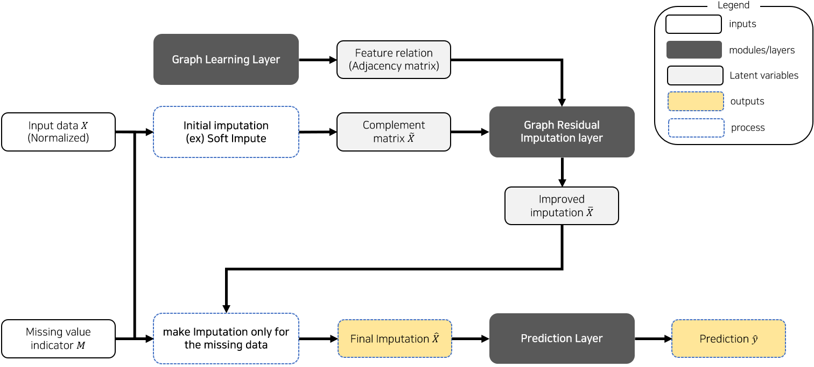
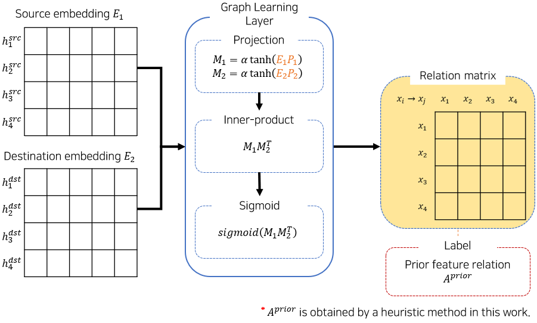
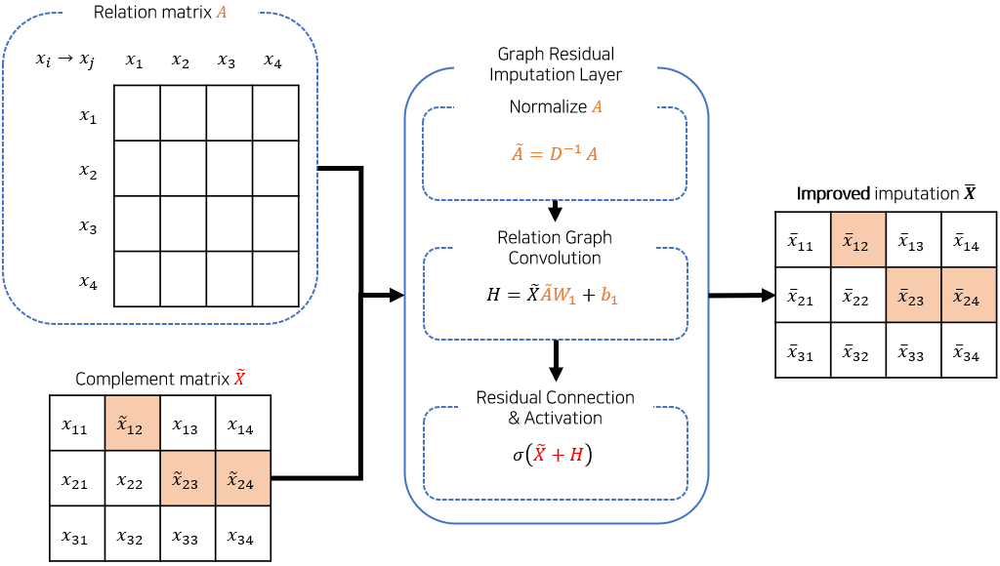
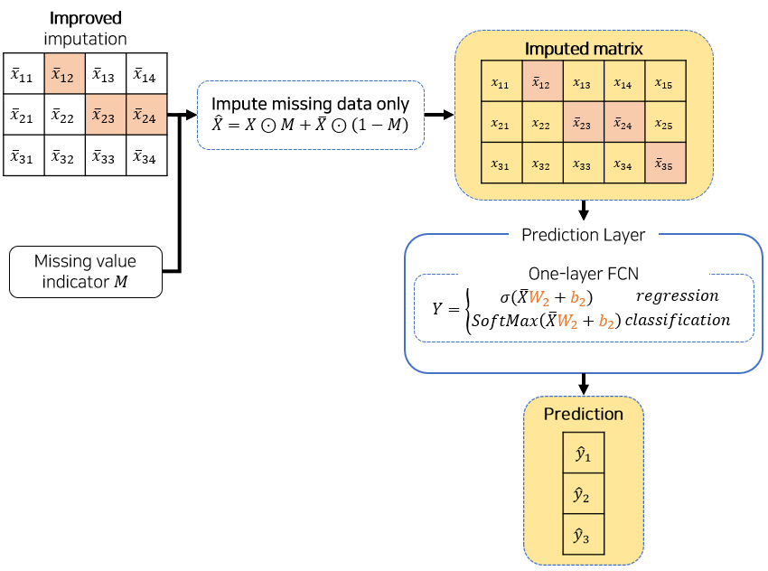
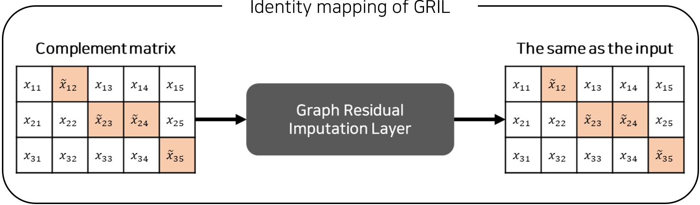
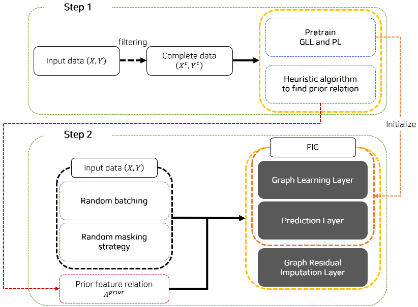
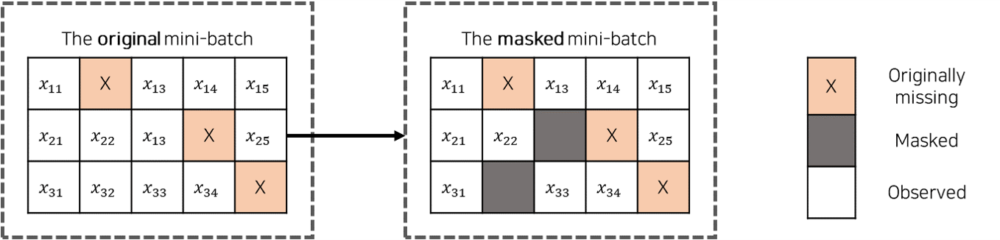
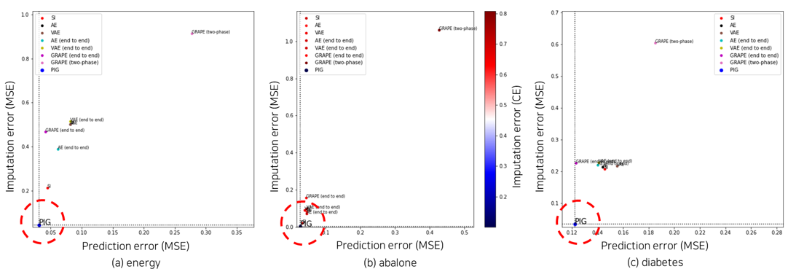
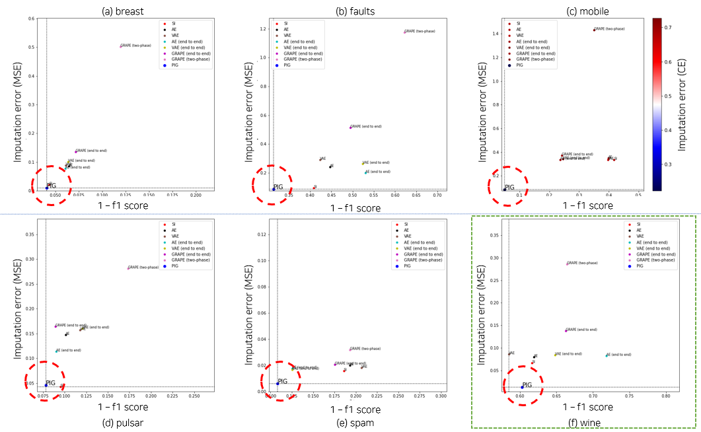

# Proposed model
PIG: Multi-task learning of Prediction and Imputation using feature relation Graph learning

# Data
Data source: UCI machine learning repository.

# Usage
Run the file `train_gi.py` to train the proposed model. notice that, `PIG` is implemented in a different name, GraphImputer.

```bash
usage: train_gi.py [-h] [--data_type DATA_TYPE] [--data_path DATA_PATH]
                   [--tr TR] [--val VAL] [--standardize]
                   [--test_missing_prob TEST_MISSING_PROB] [--prob PROB]
                   [--test_all_missing] [--test_n_missing TEST_N_MISSING]
                   [--exp_num EXP_NUM] [--batch_size BATCH_SIZE]
                   [--epoch EPOCH] [--pretrain_epoch PRETRAIN_EPOCH] [--lr LR]
                   [--patience PATIENCE] [--delta DELTA]
                   [--print_log_option PRINT_LOG_OPTION]
                   [--imp_loss_penalty IMP_LOSS_PENALTY]
                   [--reg_loss_peanlty REG_LOSS_PEANLTY]
                   [--training_missing_prob TRAINING_MISSING_PROB]
                   [--model_path MODEL_PATH] [--num_layers NUM_LAYERS]
                   [--auto_set_emb_size] [--graph_emb_dim GRAPH_EMB_DIM]
                   [--alpha ALPHA] [--model_type MODEL_TYPE] [--test]
                   [--model_file MODEL_FILE] [--model_name MODEL_NAME]
                   [--test_results_path TEST_RESULTS_PATH]
                   [--num_folds NUM_FOLDS]
```
```bash
optional arguments:
  -h, --help            show this help message and exit
  --data_type DATA_TYPE
                        one of: gestures, elec, wind
  --data_path DATA_PATH
  --tr TR               the ratio of training data to the original data
  --val VAL             the ratio of validation data to the original data
  --standardize         standardize the inputs if it is true.
  --test_missing_prob TEST_MISSING_PROB
                        the ratio of missing data to make in the original data
  --prob PROB           the ratio of missing data to make in the original
                        validation data
  --test_all_missing    force every observation in the test data to have
                        missing values.
  --test_n_missing TEST_N_MISSING
                        the number of missing values to generate by row.
                        (depreciated, it is auto-set)
  --exp_num EXP_NUM
  --batch_size BATCH_SIZE
                        input batch size
  --epoch EPOCH         the number of epochs to train for
  --pretrain_epoch PRETRAIN_EPOCH
                        the number of epochs to pre-train graph sampling layer
  --lr LR               learning rate
  --patience PATIENCE   patience of early stopping condition
  --delta DELTA         significant improvement to update a model
  --print_log_option PRINT_LOG_OPTION
                        print training loss every print_log_option
  --imp_loss_penalty IMP_LOSS_PENALTY
                        the penalty term of imputation loss
  --reg_loss_peanlty REG_LOSS_PEANLTY
                        the penalty term of regularization loss
  --training_missing_prob TRAINING_MISSING_PROB
                        the ratio of missing data to make in the original
                        training data
  --model_path MODEL_PATH
                        a path to (save) the model
  --num_layers NUM_LAYERS
                        the number of gcn layers
  --auto_set_emb_size   auto set the embedding sizes
  --graph_emb_dim GRAPH_EMB_DIM
  --alpha ALPHA         activation scale in the graph sampling layer
  --model_type MODEL_TYPE
                        graph_imputer
  --test                test
  --model_file MODEL_FILE
                        model file
  --model_name MODEL_NAME
                        model name
  --test_results_path TEST_RESULTS_PATH
                        a path to save the results
  --num_folds NUM_FOLDS
                        the number of folds
```

# Method

## High-level view of the model architecture

The high-level view of th model architecture is as follows.       


There are three main modules in the proposed model (PIG) 
      
* Graph Learning Layer (GLL) 
    * learns the feature relationships in a way that helps imputation and prediction. 
* Graph Residual Imputation Layer (GRIL) 
    * corrects the imputation residuals of an initial imputed matrix. 
* Prediction Layer (PL) 
    * makes final imputation and outputs predictions.

## Graph Learning Layer (GLL)

    
* The key idea of GLL is to locate embedding vectors of relevant features as close as possible.     
* We use source- and destination- embedding matrices to generate a directed adjacency matrix.

## Graph Residual Imputation Layer (GRIL)

There are two key processes in this layer.              

* Relation Graph Convolution: We use relevant features to estimate residuals of the complement matrix.
* Residual Connection: we use the estimated residuals to “correct” the “complement matrix”

## Prediction Layer (PL)

We simply used one-layer fully-connected-network for the prediction layer.

                 

## Training Strategy
When training the model, we consider two problems.        
1. The need for balancing tasks (avoid conflicting gradients)
2. To guide PIG to learn how to impute not to reconstruct.
    * Example) Identity mapping (the same as the complement matrix)
        *                 
        * PIG can easily reduce the imputation loss simply by repeating the input.
              
               
* Two step learning

Our training strategy is decently summarized in the below figure.


* Step 1    
    (1) Pretrain Graph Learning Layer and Prediction Layer independently.      
    (2) Obtain prior feature relationships.      
    Both are trained using complete data (w/o missing values).

* Step 2    
    Multi-task learning on both imputation and prediction.      
    We randomly mask the observed values at every forward process of a mini-batch.      
    

# Experiment results

* Evaluation metrics
    * Imputation 
        * Numeric features
            * Mean Squared Error(MSE)

        * Categorical features
            * Cross Entropy(CE)
    * Prediction
        * Regression 
            * MSE
        * Classification 
            * F1-score

* Regression and imputation


* Classification and imputation 

